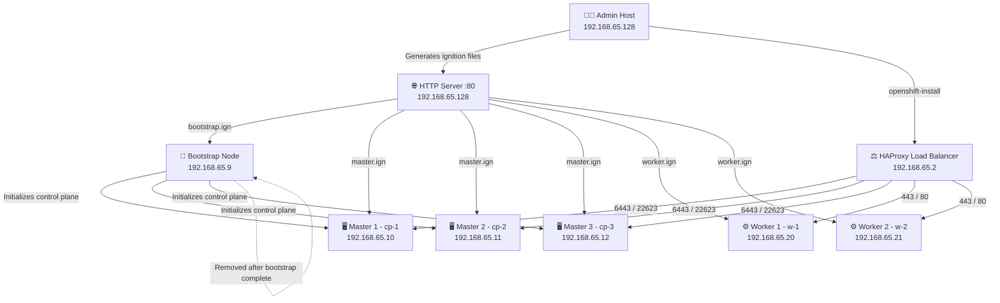

# 🔴 OpenShift 4.19.x High Availability Cluster — Bare Metal UPI

[](https://docs.openshift.com)
[](https://github.com/kishor-95)
[](https://github.com/kishor-95)
[](https://github.com/kishor-95)
[](https://github.com/kishor-95)
[](https://github.com/kishor-95)

A complete **production-grade runbook** for deploying a **High Availability OpenShift 4.19.x cluster** on **bare metal** using the **User-Provisioned Infrastructure (UPI)** method — with HAProxy load balancing, BIND DNS, DHCP, and HTTPD ignition file serving configured from scratch.

> ⚠️ This is not a lab guide. This reflects real infrastructure deployment with 3 control plane nodes, 2 workers, and full HA configuration — nodes provisioned via live CoreOS ISO on KVM/VMware.

---

## 🏗️ Cluster Architecture



---

## 📋 Cluster Topology

| Role | Nodes | Hostnames | IPs |
|------|-------|-----------|-----|
| Bootstrap | 1 | `bootstrap.test.ocp.com` | `192.168.65.9` |
| Control Plane (Masters) | 3 | `cp-1`, `cp-2`, `cp-3` | `192.168.65.10–12` |
| Workers | 2 | `w-1.test.ocp.com`, `w-2.test.ocp.com` | `192.168.65.20–21` |
| Load Balancer | 1 | `lb.test.ocp.com` | `192.168.65.2` |
| DNS / Admin / HTTP | 1 | `admin.test.ocp.com` | `192.168.65.128` |

---

## 💻 VM Resource Sizing

| Node Type | vCPU | RAM | Storage | Notes |
|-----------|------|-----|---------|-------|
| Admin / Jump Host | 2 | 4 GB | 50 GB | DNS, DHCP, HTTP server, install tools |
| Bootstrap | 4 | 8 GB | 100 GB | Deleted after install completes |
| Master (x3) | 4–8 | 16 GB | 100 GB | Runs etcd, API server |
| Worker (x2) | 4 | 16 GB | 100 GB | Runs application pods |

---

## ✅ Prerequisites

### Software Required
- `openshift-install` (v4.19.x)
- `oc` and `kubectl` CLI tools
- `httpd` — for hosting ignition files
- `bind` + `bind-utils` — BIND DNS
- `dhcp-server` — DHCP
- `haproxy` — Load Balancer
- `coreos-installer`

### Files Required
- Pull secret from [Red Hat Cloud Console](https://console.redhat.com/openshift/install)
- SSH key pair (`id_rsa` and `id_rsa.pub`)
- Live CoreOS ISO — attached as virtual boot media per node

### VM / Virtualization Setup
- Hypervisor: KVM or VMware
- Live CoreOS ISO attached as virtual boot media per node
- Network adapter in bridged mode — all nodes must reach DNS + HTTP server

### DNS Records Required

| Record | Type | Target | Purpose |
|--------|------|--------|---------|
| `api.test.ocp.com` | A | `192.168.65.2` | External API access |
| `api-int.test.ocp.com` | A | `192.168.65.2` | Internal API access |
| `*.apps.test.ocp.com` | A | `192.168.65.2` | Wildcard app routes |
| `bootstrap.test.ocp.com` | A | `192.168.65.9` | Bootstrap node |
| `cp-1.test.ocp.com` | A | `192.168.65.10` | Master 1 |
| `cp-2.test.ocp.com` | A | `192.168.65.11` | Master 2 |
| `cp-3.test.ocp.com` | A | `192.168.65.12` | Master 3 |
| `w-1.test.ocp.com` | A | `192.168.65.20` | Worker 1 |
| `w-2.test.ocp.com` | A | `192.168.65.21` | Worker 2 |

### Firewall Ports

| Port | Protocol | Purpose |
|------|----------|---------|
| 6443 | TCP | Kubernetes / OpenShift API server |
| 22623 | TCP | Machine Config Server (bootstrap only) |
| 443, 80 | TCP | App ingress (HTTPS / HTTP routes) |
| 9000 | TCP | HAProxy stats dashboard |
| 2379, 2380 | TCP | etcd client + peer replication |
| 53 | TCP/UDP | DNS |
| 4789 | UDP | SDN / VXLAN pod networking |
| 1936 | TCP | Ingress health / metrics |
| 30000–32767 | TCP | NodePort services |

---

## 🚀 Step-by-Step Installation

### Step 1 — Prepare Admin Node & Install CLI Tools

Download `oc`, `kubectl`, and `openshift-install` from [Red Hat Console](https://console.redhat.com/openshift/download):

```bash
# Extract CLI tools
tar -xvf openshift-client-linux-4.19.x.tar.gz
tar -xvf openshift-install-linux.tar.gz

# Move to system path
mv oc openshift-install kubectl /usr/local/bin/

# Verify
oc version
openshift-install version
```

---

### Step 2 — Generate SSH Key & Start SSH Agent

```bash
# Generate SSH key pair
ssh-keygen -t rsa -b 4096 -f ~/.ssh/id_rsa

# View public key (used in install-config.yaml)
cat ~/.ssh/id_rsa.pub

# Start SSH agent in background
eval "$(ssh-agent -s)"

# Add private key to agent
ssh-add ~/.ssh/id_rsa

# Verify key was loaded
ssh-add -l
```

> ⚠️ **SSH agent must be running before executing `openshift-install`.**
> The installer injects your public key into RHCOS nodes via Ignition configs.
> Without the agent, post-install node access will fail.

---

### Step 3 — Configure BIND DNS

Install BIND:
```bash
sudo dnf install bind bind-utils -y
```

Edit `/etc/named.conf` — set cluster name **test** and domain **ocp.com**:
```bash
vim /etc/named.conf
```

Key zones to define (reference in `named.conf`):
- Forward zone: `db.test.ocp.com` → translates hostnames to IPs
- Reverse zone: `1.168.192.in-addr.arpa` → translates IPs to hostnames

Start and enable DNS:
```bash
sudo systemctl enable --now named

# Validate DNS entries
dig api.test.ocp.com
dig api-int.test.ocp.com
dig +short *.apps.test.ocp.com
nslookup cp-1.test.ocp.com
```

> 📁 Full named.conf and zone files available in [`configs/named.conf`](configs/named.conf) and [`dns/zones/`](dns/zones/)

---

### Step 4 — Configure DHCP

Install DHCP server:
```bash
sudo dnf install dhcp-server -y
```

Configure static IP assignments for each node in `/etc/dhcp/dhcpd.conf`:
```bash
vim /etc/dhcp/dhcpd.conf
```

Start and enable DHCP:
```bash
sudo systemctl enable --now dhcpd
```

> 📁 Full DHCP config available in [`dhcp/`](dhcp/)

---

### Step 5 — Configure HAProxy Load Balancer

Install HAProxy:
```bash
sudo dnf install haproxy -y
```

Edit `/etc/haproxy/haproxy.cfg`:

```cfg
#---------------------------------------------------------------------
# Global Settings
#---------------------------------------------------------------------
global
  log         127.0.0.1 local2
  pidfile     /var/run/haproxy.pid
  maxconn     4000
  daemon

#---------------------------------------------------------------------
# Default Settings
#---------------------------------------------------------------------
defaults
  mode                    tcp
  log                     global
  option                  dontlognull
  option                  redispatch
  retries                 3
  timeout http-request    10s
  timeout queue           1m
  timeout connect         10s
  timeout client          1m
  timeout server          1m
  timeout check           10s
  maxconn                 3000

#---------------------------------------------------------------------
# HAProxy Stats Dashboard — http://<LB-IP>:9000/stats
#---------------------------------------------------------------------
listen stats
  mode http
  bind *:9000
  stats uri /stats
  stats refresh 10000ms

#---------------------------------------------------------------------
# Kubernetes API Server — Port 6443
# Bootstrap kept as commented backup — remove after cluster init
#---------------------------------------------------------------------
frontend api-server
  bind *:6443
  default_backend api-server-backend

backend api-server-backend
  balance     roundrobin
  option      ssl-hello-chk
  # server bootstrap 192.168.65.9:6443 check fall 2 rise 3 backup   # Remove after bootstrap complete
  server cp-1   192.168.65.10:6443 check fall 2 rise 3
  server cp-2   192.168.65.11:6443 check fall 2 rise 3
  server cp-3   192.168.65.12:6443 check fall 2 rise 3

#---------------------------------------------------------------------
# Machine Config Server — Port 22623
#---------------------------------------------------------------------
frontend mcs
  bind *:22623
  default_backend mcs-backend

backend mcs-backend
  balance roundrobin
  # server bootstrap 192.168.65.9:22623 check backup                # Remove after bootstrap complete
  server cp-1   192.168.65.10:22623 check
  server cp-2   192.168.65.11:22623 check
  server cp-3   192.168.65.12:22623 check

#---------------------------------------------------------------------
# Ingress — HTTPS Port 443
#---------------------------------------------------------------------
frontend ingress-https
  bind *:443
  default_backend ingress-https-backend

backend ingress-https-backend
  balance source
  server w-1 192.168.65.20:443 check
  server w-2 192.168.65.21:443 check

#---------------------------------------------------------------------
# Ingress — HTTP Port 80
#---------------------------------------------------------------------
frontend ingress-http
  bind *:80
  default_backend ingress-http-backend

backend ingress-http-backend
  balance source
  server w-1 192.168.65.20:80 check
  server w-2 192.168.65.21:80 check
```

Enable and verify:
```bash
sudo systemctl enable --now haproxy
sudo systemctl status haproxy
ss -tnlp | grep haproxy
```

> 📁 Full config: [`configs/haproxy.cfg`](configs/haproxy.cfg)

---

### Step 6 — Prepare Installation Directory

```bash
mkdir -p ~/ocp-install
cd ~/ocp-install
cp ~/pull-secret.json .
cp ~/.ssh/id_rsa.pub .
```

---

### Step 7 — Create `install-config.yaml`

```yaml
apiVersion: v1
baseDomain: ocp.com   ## change it as your base domain
metadata:
  name: test   # cluster name — subdomains: test.ocp.com, api.test.ocp.com, *.apps.test.ocp.com   
platform:
  none: {}
pullSecret: '<PASTE_PULL_SECRET_JSON>'
sshKey: '<PASTE_SSH_PUB_KEY>'
controlPlane:
  hyperthreading: Enabled
  name: master
  replicas: 3
compute:
- hyperthreading: Enabled
  name: worker
  replicas: 0   # Workers added manually via ignition configs
networking:
  networkType: OVNKubernetes
  clusterNetwork:
  - cidr: 10.128.0.0/14
    hostPrefix: 23
  serviceNetwork:
  - 172.30.0.0/16
fips: false
```

> 📁 Template: [`configs/install-config.yaml`](configs/install-config.yaml)

---

### Step 8 — Generate Ignition Files

```bash
cd ~/ocp-install

# Generate manifests first
openshift-install create manifests --dir=.

# Generate ignition configs
openshift-install create ignition-configs --dir=.

# Verify — should see bootstrap.ign, master.ign, worker.ign
ls -lh *.ign
```

---

### Step 9 — Configure HTTP Server (Ignition File Hosting)

```bash
sudo dnf install -y httpd

sudo mkdir -p /var/www/html/ignitions
sudo cp ~/ocp-install/*.ign /var/www/html/ignitions/

# Open firewall
sudo firewall-cmd --add-service=http --permanent
sudo firewall-cmd --reload

# Start HTTP server
sudo systemctl enable --now httpd
```

Validate ignition files are accessible:
```bash
curl -k http://192.168.65.128/ignitions/bootstrap.ign
curl -k http://192.168.65.128/ignitions/master.ign
curl -k http://192.168.65.128/ignitions/worker.ign
```

---

### Step 10 — Boot Nodes via Live CoreOS ISO & Install to Disk

> 🖥️ Each node was booted using the **live CoreOS ISO attached as a virtual boot
> image in KVM/VMware.** Installation to disk was performed manually from the live shell.

**For each node — follow this exact sequence:**

**10.1 — Attach & boot the live CoreOS ISO**
- In KVM/VMware console, attach the live CoreOS ISO as the boot device
- Power on the VM — it boots into a live CoreOS shell (not installed yet)

**10.2 — Verify network connectivity from the live shell**
```bash
ip a
ping 192.168.65.128    # Must reach the HTTP server before proceeding
```

**10.3 — Run coreos-installer from the live shell**

Bootstrap node:
```bash
sudo coreos-installer install /dev/sda \
  --insecure \
  --ignition-url http://192.168.65.128/ignitions/bootstrap.ign
```

Each Master (cp-1, cp-2, cp-3):
```bash
sudo coreos-installer install /dev/sda \
  --insecure \
  --ignition-url http://192.168.65.128/ignitions/master.ign
```

Each Worker (w-1, w-2):
```bash
sudo coreos-installer install /dev/sda \
  --insecure \
  --ignition-url http://192.168.65.128/ignitions/worker.ign
```

**10.4 — Reboot into installed system**
```bash
sudo reboot
```

> ⚠️ **Detach the ISO before reboot** — otherwise the VM boots back into the
> live shell instead of the installed disk.

**10.5 — Verify from admin host**
```bash
oc get nodes -w
```

---

### Step 11 — Monitor Bootstrap Process

```bash
openshift-install --dir=~/ocp-install wait-for bootstrap-complete --log-level=debug
```

> ✅ Once complete — **comment out or remove the bootstrap server entries from
> HAProxy (`api-server-backend` and `mcs-backend`) and power off the bootstrap VM.**

---

### Step 12 — Configure Cluster Access

```bash
export KUBECONFIG=~/ocp-install/auth/kubeconfig

# Verify cluster access
oc whoami
# Expected output: system:admin

oc get nodes
```

---

### Step 13 — Approve Certificate Signing Requests (CSRs)

When nodes join the cluster, each generates two CSRs — run approval **twice** (once for client CSRs, once for server CSRs):

```bash
# Check pending CSRs
oc get csr

# Approve all at once
for csr in $(oc get csr --no-headers | awk '{print $1}'); do
  oc adm certificate approve $csr
done

# Run again after a few minutes for server-side CSRs
oc get csr
for csr in $(oc get csr --no-headers | awk '{print $1}'); do
  oc adm certificate approve $csr
done
```

---

### Step 14 — Wait for All Cluster Operators

```bash
oc get clusteroperators
```

All operators must show:

| AVAILABLE | PROGRESSING | DEGRADED |
|-----------|-------------|----------|
| True | False | False |

Once all operators are healthy, complete the installation:
```bash
openshift-install --dir=~/ocp-install wait-for install-complete --log-level=debug
```

---

### Step 15 — Final Verification

```bash
oc get nodes -o wide
oc get pods -A | egrep -v 'Running|Completed'
oc get clusterversion
```

---

## 🔐 Post-Install: Apply Self-Signed Wildcard TLS Certificate

### 1 — Generate Key and Certificate

```bash
mkdir -p /tmp/ocp-cert && cd /tmp/ocp-cert

# Generate 4096-bit private key
openssl genrsa -out wildcard.key 4096

# Generate self-signed cert valid for 2 years
openssl req -x509 -new -nodes -key wildcard.key -sha256 -days 730 \
  -out wildcard.crt \
  -subj "/CN=*.apps.test.ocp.com/O=Kishor/OU=IT" \
  -addext "subjectAltName=DNS:*.apps.test.ocp.com,DNS:apps.test.ocp.com"
```

### 2 — Create TLS Secret in OpenShift

```bash
oc create secret tls custom-router-certs \
  -n openshift-ingress \
  --cert=wildcard.crt \
  --key=wildcard.key

# Verify
oc get secret custom-router-certs -n openshift-ingress -o yaml
```

### 3 — Patch Default IngressController

```bash
oc patch ingresscontroller default \
  -n openshift-ingress-operator \
  --type=merge \
  -p '{"spec":{"defaultCertificate":{"name":"custom-router-certs"}}}'
```

### 4 — Verify Certificate Rollout

```bash
# Watch router pods restart
oc get pods -n openshift-ingress -w

# Verify TLS cert after pods are Running
openssl s_client -connect oauth-openshift.apps.test.ocp.com:443 \
  -servername oauth-openshift.apps.test.ocp.com \
  2>/dev/null | openssl x509 -noout -subject -issuer -dates
```

---

## 👥 Post-Install: Create OpenShift Users via HTPasswd

Create two users: `kishor` (cluster-admin) and `prajwal` (developer)

### 1 — Install htpasswd Utility

```bash
sudo dnf install httpd-tools -y
```

### 2 — Create Users

```bash
# Create file and add kishor (use -c only once to create the file)
htpasswd -c -B -b users.htpasswd kishor <password>

# Add prajwal (no -c flag — would overwrite the file)
htpasswd -B -b users.htpasswd prajwal <password>

# Verify
cat users.htpasswd
```

### 3 — Create Secret in OpenShift

```bash
oc create secret generic htpass-secret \
  --from-file=htpasswd=users.htpasswd \
  -n openshift-config

oc get secret htpass-secret -n openshift-config -o yaml
```

### 4 — Configure HTPasswd OAuth Provider

Apply [`configs/oauth-htpasswd.yaml`](configs/oauth-htpasswd.yaml):

```yaml
apiVersion: config.openshift.io/v1
kind: OAuth
metadata:
  name: cluster
spec:
  identityProviders:
  - name: localusers
    mappingMethod: claim
    type: HTPasswd
    htpasswd:
      fileData:
        name: htpass-secret
```

```bash
oc apply -f configs/oauth-htpasswd.yaml

# Wait 1-2 minutes for auth components to reconcile
oc get pods -n openshift-authentication
oc get oauth cluster -o yaml
```

### 5 — Assign Roles

```bash
# Grant cluster-admin to kishor
oc adm policy add-cluster-role-to-user cluster-admin kishor

# Create test project and grant edit role to prajwal
oc new-project test
oc adm policy add-role-to-user edit prajwal -n test
```

---

## 🔧 Post-Install Checklist

- [ ] Remove bootstrap VM from HAProxy and power off
- [ ] Configure image registry storage (NFS or PVC)
- [ ] Apply self-signed TLS certificate (see above)
- [ ] Create admin/developer users via HTPasswd (see above)
- [ ] Backup `~/ocp-install/auth/kubeconfig` securely
- [ ] Set up regular operator and node health monitoring

> Full post-install guide → [README-postinstall.md](README-postinstall.md)

---

## 📁 Repo Structure

```
openshift/
│
├── README.md                    ← This runbook
├── README-postinstall.md        ← Post-install configuration guide
├── .gitignore                   ← Excludes sensitive files
│
├── configs/
│   ├── install-config.yaml      ← Cluster install config template
│   ├── haproxy.cfg              ← Production HAProxy config
│   ├── named.conf               ← BIND DNS config
│   └── oauth-htpasswd.yaml      ← HTPasswd OAuth provider config
│
├── dns/
│   └── zones/
│       ├── db.test.ocp.com      ← Forward DNS zone
│       └── 1.168.192.in-addr.arpa ← Reverse DNS zone
│
├── dhcp/                        ← DHCP server config
│
└── docs/
    ├── Apply_Self_signed.docx
    ├── Create_users.docx
    └── Storage_class.pdf
```
---
## 📚 References

- [OpenShift UPI Bare Metal Installation Docs](https://docs.openshift.com/container-platform/latest/installing/installing_bare_metal/installing-bare-metal.html)
- [Red Hat Knowledgebase](https://access.redhat.com/documentation/en-us/openshift_container_platform/)
- [CoreOS Installer Docs](https://coreos.github.io/coreos-installer/)
- [OpenShift Downloads](https://console.redhat.com/openshift/download)

---

## 👨‍💻 Author

**Kishor Bhairat** — Linux System Administrator | DevOps Engineer
📫 bhairatkishor@gmail.com | [LinkedIn](https://www.linkedin.com/in/kishor-bhairat) | [GitHub](https://github.com/kishor-95)
