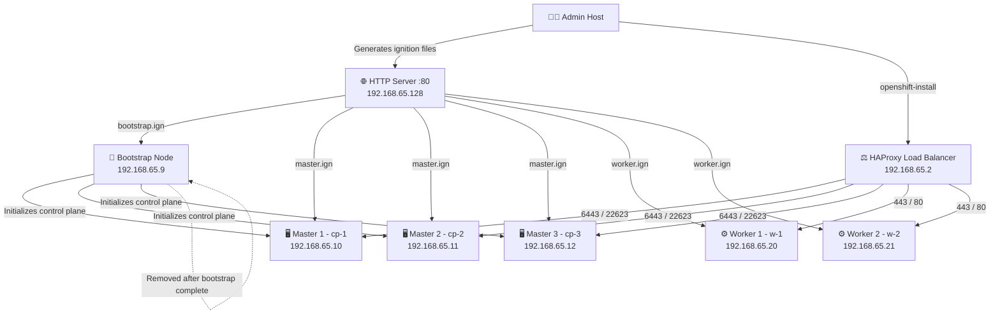

# 🔴 OpenShift 4.19.x High Availability Cluster — Bare Metal UPI

[](https://docs.openshift.com)
[](https://github.com/kishor-95)
[](https://github.com/kishor-95)
[](https://github.com/kishor-95)
[](https://github.com/kishor-95)
[](https://github.com/kishor-95)

A complete **production-grade runbook** for deploying a **High Availability OpenShift 4.19.x cluster** on **bare metal** using the **User-Provisioned Infrastructure (UPI)** method — with HAProxy load balancing, BIND DNS, and HTTPD ignition file serving configured from scratch.

> ⚠️ This is not a lab guide. This reflects real infrastructure deployment with 3 control plane nodes, 2 workers, and full HA configuration — nodes provisioned via live CoreOS ISO on KVM/VMware.

---

## 🏗️ Cluster Architecture


---

## 📋 Cluster Topology

| Role | Quantity | Hostnames | IPs |
|------|----------|-----------|-----|
| Bootstrap | 1 | `bootstrap.test.ocp.com` | `192.168.65.9` |
| Control Plane (Masters) | 3 | `cp-1`, `cp-2`, `cp-3` | `192.168.65.10–12` |
| Workers | 2 | `w-1.test.ocp.com`, `w-2.test.ocp.com` | `192.168.65.20–21` |
| Load Balancer | 1 | `lb.test.ocp.com` | `192.168.65.2` |
| DNS Server | 1 | `dns.test.ocp.com` | `192.168.65.128` |

---

## ✅ Prerequisites

### Software Required
- `openshift-install` (v4.19.x)
- `oc` CLI tools
- `httpd` — for hosting ignition files
- `coreos-installer`
- `haproxy`

### Files Required
- Pull secret from [Red Hat Cloud Console](https://console.redhat.com/openshift/install)
- SSH key pair (`id_rsa` and `id_rsa.pub`)
- Live CoreOS ISO — attached as virtual boot media per node

### VM / Virtualization Setup
- Hypervisor: KVM or VMware
- Live CoreOS ISO attached as virtual boot media per node
- Each VM disk: minimum 120GB recommended for OCP nodes
- Network adapter in bridged mode — all nodes must reach DNS + HTTP server

### DNS Records Required

| Record | Type | Target |
|--------|------|--------|
| `api.test.ocp.com` | A | `192.168.65.2` |
| `api-int.test.ocp.com` | A | `192.168.65.2` |
| `*.apps.test.ocp.com` | A | `192.168.65.2` |

### Firewall Ports

| Port | Protocol | Purpose |
|------|----------|---------|
| 6443 | TCP | Kubernetes API Server |
| 22623 | TCP | Machine Config Server |
| 9000 | TCP | HAProxy Stats Dashboard |
| 443, 80 | TCP | Router / Apps Ingress |

---

## 🚀 Step-by-Step Installation

### Step 1 — Prepare Installation Directory
```bash
mkdir -p ~/ocp-install
cd ~/ocp-install
cp ~/pull-secret.json .
cp ~/.ssh/id_rsa.pub .
```

---

### Step 2 — Create `install-config.yaml`
```yaml
apiVersion: v1
baseDomain: test.ocp.com
metadata:
  name: test
platform:
  none: {}
pullSecret: '<PASTE_PULL_SECRET_JSON>'
sshKey: '<PASTE_SSH_PUB_KEY>'
controlPlane:
  name: master
  replicas: 3
compute:
- name: worker
  replicas: 0   # Workers added manually via ignition configs
networking:
  networkType: OVNKubernetes
  clusterNetwork:
  - cidr: 10.128.0.0/14
    hostPrefix: 23
  serviceNetwork:
  - 172.30.0.0/16
fips: false
```

---

### Step 3 — Generate Ignition Files
```bash
openshift-install create manifests --dir=.
openshift-install create ignition-configs --dir=.
ls -l *.ign
```
Expected output: `bootstrap.ign`, `master.ign`, `worker.ign`

---

### Step 4 — Configure HTTP Server (Ignition File Hosting)
```bash
sudo dnf install -y httpd
sudo mkdir -p /var/www/html/ignitions
sudo cp ~/ocp-install/*.ign /var/www/html/ignitions/
sudo systemctl enable --now httpd
sudo firewall-cmd --add-service=http --permanent
sudo firewall-cmd --reload
```
Validate:
```bash
curl http://192.168.65.128/ignitions/bootstrap.ign
```

---

### Step 5 — Configure HAProxy Load Balancer

Edit `/etc/haproxy/haproxy.cfg`:
```cfg
#---------------------------------------------------------------------
# Global Settings
#---------------------------------------------------------------------
global
  log         127.0.0.1 local2
  pidfile     /var/run/haproxy.pid
  maxconn     4000
  daemon

#---------------------------------------------------------------------
# Default Settings
#---------------------------------------------------------------------
defaults
  mode                    tcp
  log                     global
  option                  dontlognull
  option                  redispatch
  retries                 3
  timeout http-request    10s
  timeout queue           1m
  timeout connect         10s
  timeout client          1m
  timeout server          1m
  timeout check           10s
  maxconn                 3000

#---------------------------------------------------------------------
# HAProxy Stats Dashboard — http://<LB-IP>:9000/stats
#---------------------------------------------------------------------
listen stats
  mode http
  bind *:9000
  stats uri /stats
  stats refresh 10000ms

#---------------------------------------------------------------------
# Kubernetes API Server — Port 6443
# Bootstrap kept as commented backup — remove after cluster init
#---------------------------------------------------------------------
frontend api-server
  bind *:6443
  default_backend api-server-backend

backend api-server-backend
  balance     roundrobin
  option      ssl-hello-chk
  # server bootstrap 192.168.65.9:6443 check fall 2 rise 3 backup   # Remove after bootstrap complete
  server cp-1   192.168.65.10:6443 check fall 2 rise 3
  server cp-2   192.168.65.11:6443 check fall 2 rise 3
  server cp-3   192.168.65.12:6443 check fall 2 rise 3

#---------------------------------------------------------------------
# Machine Config Server — Port 22623
# Serves ignition configs to nodes during bootstrap
#---------------------------------------------------------------------
frontend mcs
  bind *:22623
  default_backend mcs-backend

backend mcs-backend
  balance roundrobin
  # server bootstrap 192.168.65.9:22623 check backup                # Remove after bootstrap complete
  server cp-1   192.168.65.10:22623 check
  server cp-2   192.168.65.11:22623 check
  server cp-3   192.168.65.12:22623 check

#---------------------------------------------------------------------
# Ingress — HTTPS Port 443
#---------------------------------------------------------------------
frontend ingress-https
  bind *:443
  default_backend ingress-https-backend

backend ingress-https-backend
  balance source
  server w-1 192.168.65.20:443 check
  server w-2 192.168.65.21:443 check

#---------------------------------------------------------------------
# Ingress — HTTP Port 80
#---------------------------------------------------------------------
frontend ingress-http
  bind *:80
  default_backend ingress-http-backend

backend ingress-http-backend
  balance source
  server w-1 192.168.65.20:80 check
  server w-2 192.168.65.21:80 check
```

Enable and verify:
```bash
sudo systemctl enable --now haproxy
ss -tnlp | grep haproxy
```

---

### Step 6 — Boot Nodes via Live CoreOS ISO & Install to Disk

> 🖥️ Each node (Bootstrap, Masters, Workers) was booted using the
> **live CoreOS ISO attached as a virtual boot image in KVM/VMware.**
> Installation to disk was performed manually from the live shell.

**For each node — follow this sequence:**

**6.1 — Attach & boot the live CoreOS ISO**
- In your KVM/VMware console, attach the live CoreOS ISO as the boot device
- Power on the VM — it boots into a live CoreOS shell (no installation yet)

**6.2 — Verify network connectivity from live shell**
```bash
ip a
ping 192.168.65.128    # Confirm you can reach the HTTP server hosting ignition files
```

**6.3 — Run coreos-installer manually from live shell**

Bootstrap node:
```bash
sudo coreos-installer install /dev/sda \
  --insecure \
  --ignition-url http://192.168.65.128/ignitions/bootstrap.ign
```

Each Master (cp-1, cp-2, cp-3):
```bash
sudo coreos-installer install /dev/sda \
  --insecure \
  --ignition-url http://192.168.65.128/ignitions/master.ign
```

Each Worker (w-1, w-2):
```bash
sudo coreos-installer install /dev/sda \
  --insecure \
  --ignition-url http://192.168.65.128/ignitions/worker.ign
```

**6.4 — Reboot into installed system**
```bash
sudo reboot
```
> ⚠️ **Detach the ISO before reboot or change the boot order to installed disk** — otherwise the VM boots back into the live shell instead of the installed disk.

**6.5 — Verify node appeared on admin host**
```bash
oc get nodes -w
```

---

### Step 7 — Start & Monitor Installation
```bash
openshift-install create cluster --dir=~/ocp-install --log-level=info
tail -f ~/ocp-install/.openshift_install.log
```

---

### Step 8 — Wait for Bootstrap Complete
```bash
openshift-install wait-for bootstrap-complete \
  --dir=~/ocp-install --log-level=debug
```
> ✅ Once complete — **remove the bootstrap node from HAProxy backends and power it off.**

---

### Step 9 — Configure Cluster Access & Approve CSRs
```bash
export KUBECONFIG=~/ocp-install/auth/kubeconfig
oc get nodes
```
Approve all pending CSRs — **run this twice** (once for client CSRs, once for server CSRs):
```bash
oc get csr
for csr in $(oc get csr --no-headers | awk '{print $1}'); do
  oc adm certificate approve $csr
done
```

---

### Step 10 — Wait for All Cluster Operators
```bash
oc get co
```
All operators must show:

| AVAILABLE | PROGRESSING | DEGRADED |
|-----------|-------------|----------|
|   True    |   False     |   False  |

---

### Step 11 — Final Verification
```bash
oc get nodes -o wide
oc get pods -A | egrep -v 'Running|Completed'
oc get clusterversion
```

---

## 🔧 Post-Install Checklist

- [ ] Configure image registry storage (NFS or PVC)
- [ ] Apply custom self-signed TLS certificates
- [ ] Create admin/developer users via HTPasswd
- [ ] Remove bootstrap VM from HAProxy and power off
- [ ] Backup `auth/kubeconfig` securely
- [ ] Set up regular operator and node health checks

> Full post-install guide → [README-postinstall.md](README-postinstall.md)

---

## 📁 Repo Structure
```
openshift-ha-upi-baremetal/
│
├── README.md                  ← This runbook
├── README-postinstall.md      ← Post-install configuration guide
├── configs/
│   ├── install-config.yaml    ← Cluster install config template
│   └── haproxy.cfg            ← Production HAProxy load balancer config
└── diagrams/
    └── cluster-architecture.png
```

---
## 📚 References

- [OpenShift UPI Bare Metal Installation Docs](https://docs.openshift.com/container-platform/latest/installing/installing_bare_metal/installing-bare-metal.html)
- [Red Hat Knowledgebase](https://access.redhat.com/documentation/en-us/openshift_container_platform/)
- [CoreOS Installer Docs](https://coreos.github.io/coreos-installer/)

---

## 👨‍💻 Author

**Kishor Bhairat** — Linux System Administrator | DevOps Engineer
📫 bhairatkishor@gmail.com | [LinkedIn](https://www.linkedin.com/in/kishor-bhairat) | [GitHub](https://github.com/kishor-95)